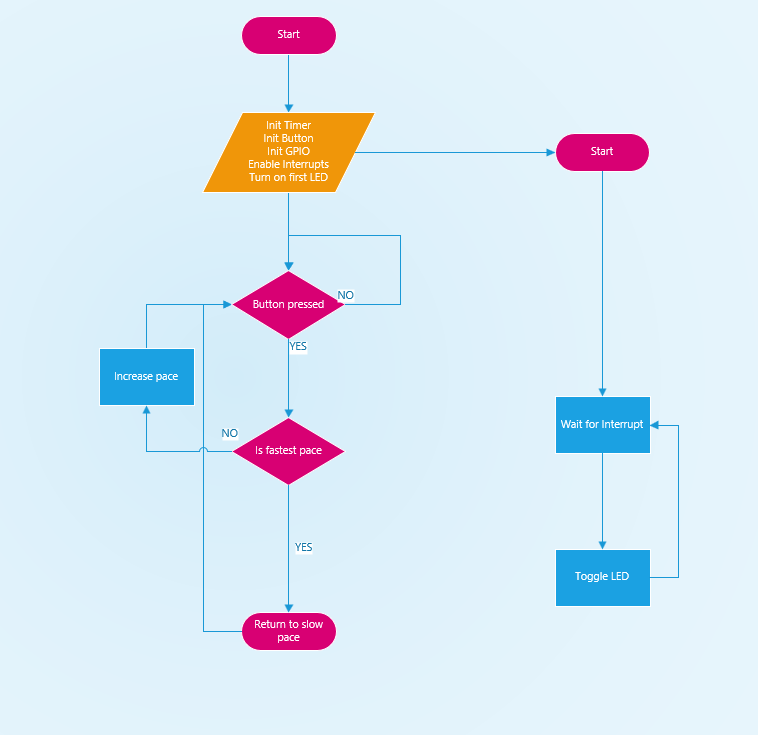
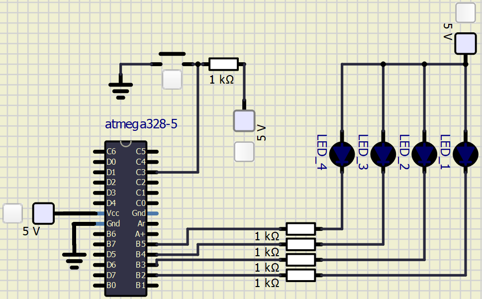

# Lab 4: Jan Rajm

Link to your `Digital-electronics-2` GitHub repository:

   [https://github.com/xrajmj00/Digital-electronics-2](https://github.com/xrajmj00/Digital-electronics-2)


### Overflow times

1. Complete table with overflow times.

| **Module** | **Number of bits** | **1** | **8** | **32** | **64** | **128** | **256** | **1024** |
| :-: | :-: | :-: | :-: | :-: | :-: | :-: | :-: | :-: |
| Timer/Counter0 | 8  | 16u | 128u | -- | 1024 us | -- | 4.096 ms | 16.384 ms |
| Timer/Counter1 | 16 | 4.096 ms | 32.768 ms | -- | 262.144 ms | -- | 1.048576 s | 4.194304 s |
| Timer/Counter2 | 8  | 16u | 128u | -- | 1024 us | -- | 4.096 ms | 16.384 ms |


### Timer library

1. In your words, describe the difference between common C function and interrupt service routine.
   * Function = execution of series of instructions, loops used on multiple places in code
   * Interrupt service routine = HW interruption of executing function and execution of other function. After that the first function continues.

2. Part of the header file listing with syntax highlighting, which defines settings for Timer/Counter0:

```c
/**
 * @name  Definitions of Timer/Counter0
 * @note  F_CPU = 16 MHz
 */
/**
 * @name  Definitions for 8-bit Timer/Counter0
 * @note  t_OVF = 1/F_CPU * prescaler * 2^n where n = 8, F_CPU = 16 MHz
 */
/**
 * @name  Definitions for 8-bit Timer/Counter0
 * @note  t_OVF = 1/F_CPU * prescaler * 2^n where n = 8, F_CPU = 16 MHz
 */
#define TIM0_stop()                         TCCR0B &= ~((1<<CS02) | (1<<CS01) | (1<<CS00));
/** @brief Set overflow 16us, prescaler 001 --> 1 */
#define TIM0_overflow_16us()                TCCR0B &= ~((1<<CS02) | (1<<CS01)); TCCR0B |= (1<<CS00);
/** @brief Set overflow 128us, prescaler 010 --> 8 */
#define TIM0_overflow_128us()               TCCR0B &= ~((1<<CS02) | (1<<CS00)); TCCR0B |= (1<<CS01);
/** @brief Set overflow 1024 us, prescaler 011 --> 64 */
#define TIM0_overflow_1024us()              TCCR0B &= ~(1<<CS02); TCCR0B |= (1<<CS01) | (1<<CS00);
/** @brief Set overflow 4096us, prescaler 100 --> 256 */
#define TIM0_overflow_4096us()              TCCR0B &= ~((1<<CS01) | (1<<CS00)); TCCR0B |= (1<<CS02);
/** @brief Set overflow 16384 us, prescaler // 101 --> 1024 */
#define TIM0_overflow_16384us()             TCCR0B &= ~(1<<CS01); TCCR0B |= (1<<CS02) | (1<<CS00);
/** @brief Enable overflow interrupt, 1 --> enable */
#define TIM0_overflow_interrupt_enable()    TIMSK0 |= (1<<TOIE0);
/** @brief Disable overflow interrupt, 0 --> disable */
#define TIM0_overflow_interrupt_disable()   TIMSK0 &= ~(1<<TOIE0);
```

3. Flowchart figure for function `main()` and interrupt service routine `ISR(TIMER1_OVF_vect)` of application that ensures the flashing of one LED in the timer interruption. When the button is pressed, the blinking is faster, when the button is released, it is slower. Use only a timer overflow and not a delay library. The image can be drawn on a computer or by hand. Use clear descriptions of the individual steps of the algorithms.

   


### Knight Rider

1. Scheme of Knight Rider application with four LEDs and a push button, connected according to Multi-function shield. Connect AVR device, LEDs, resistors, push button, and supply voltage. The image can be drawn on a computer or by hand. Always name all components and their values.

   
