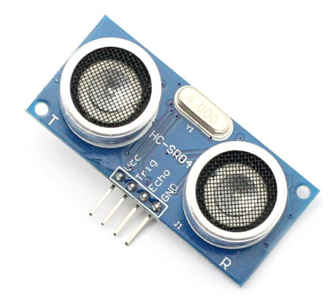
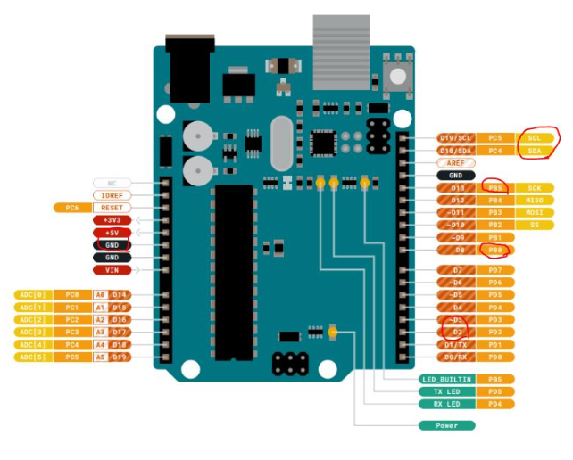
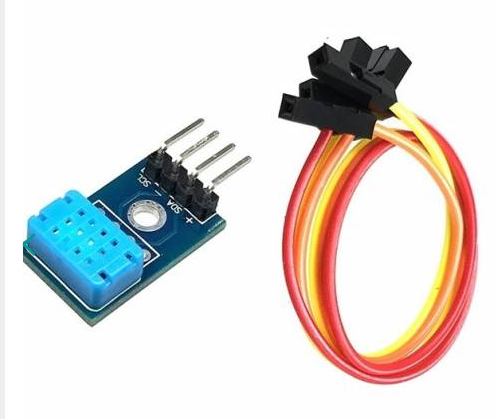
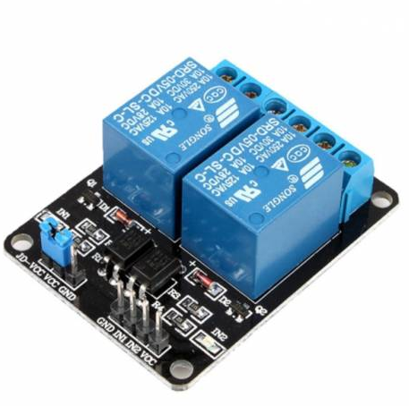
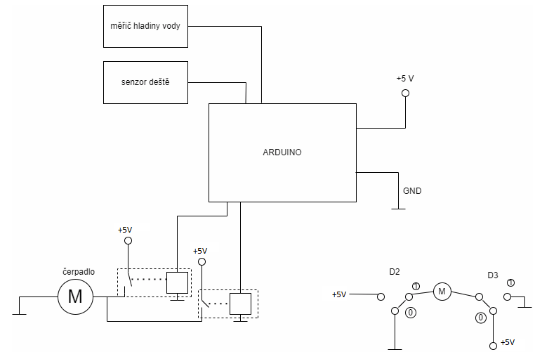
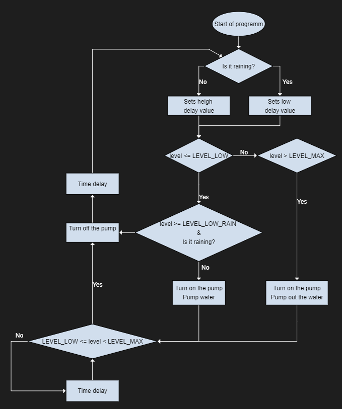
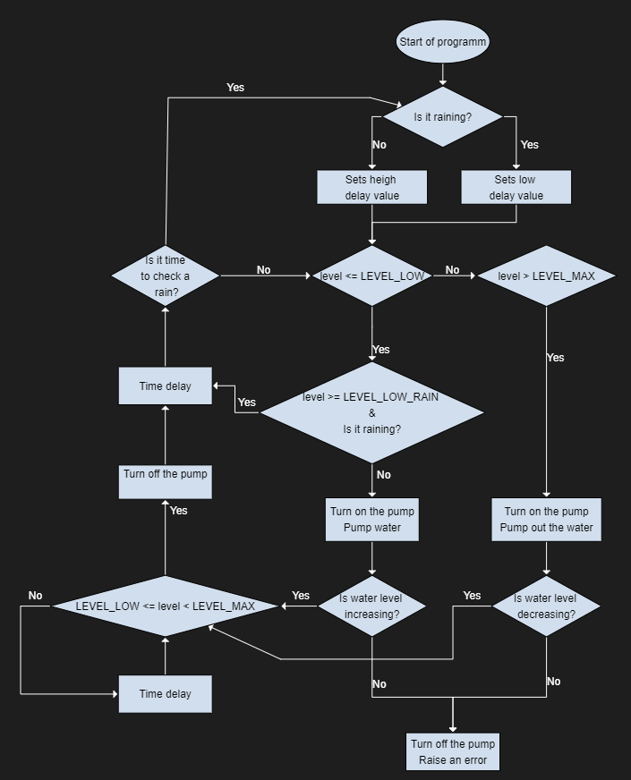

  # Water tank controller

### Team members

* Jan Rajm (flowchart, návrh FSM, programování)
* Tomáš Rotrekl (senzor vzdálenosti, programování)
* Martin Šomšák (zpracování)
[Tomáš Rotrekl](https://github.com/xrajmj00/Digital-electronics-2)

Link to this file in your GitHub repository:

https://github.com/xrajmj00/Digital-electronics-2/tree/main/Labs/Project

### Table of contents

* [Project objectives](#objectives)
* [Hardware description](#hardware)
* [Libraries description](#libs)
* [Main application](#main)
* [Video](#video)
* [References](#references)

## Project objectives

Cílem bylo sestrojit chytrou vodní pumpu, která bude schopná udržovat výšku hladiny v požadovaných mezích. Předpokládalo se, že tato chytrá pumpa bude sloužit u lokálního zdroje vody, tzn. že je k dispozici hlavní zdroj vody, ze kterého by bylo možné dočerpávat vodu v případě potřeby (např. vodovodní řád).

## Hardware description

K měření hladiny vody byl použit ultrazvukový měřič vzdálenosti: [Ultrasonic HC-SR04 Module](https://www.electronicwings.com/avr-atmega/ultrasonic-module-hc-sr04-interfacing-with-atmega1632)
Ultrazvukový modul HC-SR04 pracuje na principu systému SONAR a RADAR. Má ultrazvukový vysílač, přijímač a řídicí obvod. 4 piny, *Vcc, Gnd, Trig a Echo*. Přivedením pulsu na Trig (10us) vygeneruje 8 pulsu s frekvencí 40kHz a Echo pin se přepne do vysoké úrovně a zůstane tak dokud nedostane signál zpět. Podle času jak dlouho byl pin Echo v úrovni High se pak lehce spočítá pomocí rychlosti zvuku ve vzduchu vzdálenost objektu, v našem případě vodní hladiny.

Byla použita deska *Arduino Uno* s čipem [ATmega328P](https://www.microchip.com/en-us/product/ATmega328p)

K měření vlhkosti jsme použili [I2C teploměr a vlhkoměr DHT12 digitální](https://dratek.cz/martin/1977-i2c-teplomer-a-vlhkomer-dht12-digitalni.html)

Pro spínání motoru/pumpy (v našem případě LED diod) bylo použito [2-kanálové relé modul 5VDC 250VAC 10A](https://dratek.cz/arduino/834-arduino-rele-2-kanaly.html)

## Libraries description

Byly použity knihovny:

**gpio.h** pro nastavování a práci s piny

**timer.h** pro časování a přerušení

**twi.h** pro komunikaci pomocí rozhranáí I2C

**uart.h** pro sériovou komunikaci

## Main application

Schema zapojení: 

Flowchart podle kterého probíhalo programovaní:

Složitější flowchart, jak by mohl vypadat při rozšíření.

návrh FSM: 

## Video

 [Video](https://www.youtube.com/watch?v=KrOki5VO4F4)
 
 

 https://www.youtube.com/watch?v=KrOki5VO4F4

## References

[1] https://www.electronicwings.com/avr-atmega/ultrasonic-module-hc-sr04-interfacing-with-atmega1632

[2] https://github.com/tomas-fryza/Digital-electronics-2/blob/master/Docs/arduino_shield.pdf
